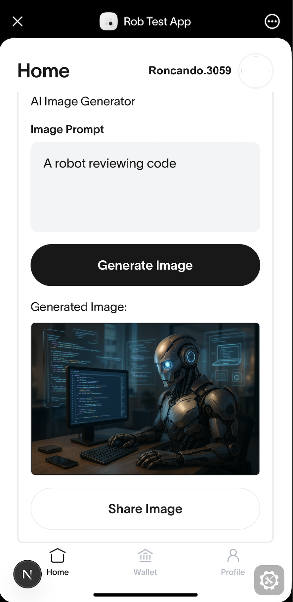

## World Mini App with ATXP Integration

[Mini apps](https://docs.worldcoin.org/mini-apps) enable third-party developers to create native-like applications within World App.

This template demonstrates how to integrate **ATXP (Autonomous Transaction Execution Protocol)** into a World Mini App, enabling AI-powered payments and MCP (Model Context Protocol) server interactions.



## Features

- 🤖 **ATXP Integration** - AI-powered payment processing for MCP servers
- 🖼️ **Image Generation** - Example of paying for AI services with USDC on World Chain
- 💳 **MiniKit Payments** - Seamless in-app USDC transactions
- 🔧 **MCP Protocol** - Connect to AI services with automatic payment handling

## Getting Started

### Prerequisites

- Node.js 18+ and pnpm
- World App installed on your device

### Installation

1. **Clone and set up environment:**
   ```bash
   cp .env.example .env.local
   # Follow the instructions in the .env.local file
   ```

2. **Install dependencies:**
   ```bash
   pnpm install
   ```

3. **Set up authentication:**
   ```bash
   npx auth secret  # Updates AUTH_SECRET in .env.local
   ```

4. **Start development server:**
   ```bash
   pnpm run dev
   ```

5. **Set up tunnel for testing:**
   ```bash
   ngrok http 3000
   ```

6. **Configure your ngrok URL:**
   - Update `AUTH_URL` in `.env.local` with your ngrok URL
   - The `next.config.ts` automatically reads from `AUTH_URL` for domain configuration
   - Register your app at [developer.worldcoin.org](https://developer.worldcoin.org)

### Testing the ATXP Integration

1. **Login** to the app using World App
2. **Navigate to Image Generation** to test ATXP payments
3. **Generate an image** - this will trigger a USDC payment on World Chain through ATXP
4. **Monitor the console** for detailed payment and MCP interaction logs

## ATXP Integration Architecture

### Core Components

The ATXP integration is primarily implemented in **`src/contexts/atxpContext.tsx`**, which provides:

#### 1. **ATXP Account Management**
```typescript
// Automatic account initialization when user logs in
const atxpAccount = await createMiniKitWorldchainAccount({
  walletAddress,
  miniKit: MiniKit
});
```

#### 2. **AI Service Integration**
```typescript
// Connect to MCP servers with automatic payment handling
const imageClient = await atxpClient({
  account: atxpAccount,
  mcpServer: "https://image.mcp.atxp.ai/",
  onPayment: async ({ payment }) => {
    console.log("Payment processed:", payment);
  }
});
```

#### 3. **Transaction Flow**
1. **User Authentication** - World App wallet authentication via MiniKit
2. **ATXP Account Setup** - Creates Worldchain account with MiniKit provider
3. **MCP Client Creation** - Connects to AI services with payment capabilities
4. **Service Calls** - AI requests automatically trigger USDC payments when needed
5. **Payment Confirmation** - Real-time payment status and transaction monitoring

### Key Files

- **`src/contexts/atxpContext.tsx`** - Main ATXP integration logic
- **`src/providers/index.tsx`** - Buffer polyfills and global setup

### ATXP Flow Example

```typescript
// 1. Generate image with automatic payment
const result = await generateImage({
  prompt: "A sunset over mountains",
  messageId: "msg_123"
});

// 2. ATXP handles the payment flow:
// - Detects MCP server requires payment
// - Prompts user for USDC payment via MiniKit
// - Executes payment on World Chain
// - Forwards request to AI service
// - Returns generated image URL

// 3. Wait for async processing
const imageUrl = await waitForImage({ taskId: result.taskId });
```

## Authentication

This starter kit uses [Minikit's](https://github.com/worldcoin/minikit-js) wallet auth to authenticate users, and [next-auth](https://authjs.dev/getting-started) to manage sessions.

## UI Library

This starter kit uses [Mini Apps UI Kit](https://github.com/worldcoin/mini-apps-ui-kit) to style the app. We recommend using the UI kit to make sure you are compliant with [World App's design system](https://docs.world.org/mini-apps/design/app-guidelines).

## Development Notes

### ATXP Package Dependencies

This example uses locally linked ATXP packages:
```json
"@atxp/client": "^0.7.0",
"@atxp/common": "^0.7.0",
"@atxp/worldchain": "^0.7.0"
```

### Environment Variables

Key environment variables in `.env.local`:
- `AUTH_SECRET` - NextAuth.js authentication secret
- `AUTH_URL` - Your ngrok URL for development (automatically used by next.config.ts)
- `NEXT_PUBLIC_APP_ID` - Your World App ID from developer portal

### Buffer Polyfills

The app includes browser polyfills for Node.js Buffer in `src/providers/index.tsx` to support:
- ATXP cryptographic operations
- MCP protocol message encoding/decoding
- Base64url encoding for OAuth flows

## Troubleshooting

### Common Issues

1. **"signMessage command is unavailable"**
   - Ensure MiniKit is properly initialized in the React context
   - Verify you're passing the MiniKit instance to `createMiniKitWorldchainAccount`

2. **"Buffer is not defined"**
   - Clear `node_modules` and reinstall: `rm -rf node_modules && pnpm install`
   - Restart dev server after installing new dependencies

3. **Authentication failures**
   - Check that `AUTH_SECRET` matches between `.env.local` and your auth configuration
   - Verify your ngrok URL is registered in the World developer portal

### Development Tools

#### Eruda Console

[Eruda](https://github.com/liriliri/eruda) provides in-app console debugging. Disable in production:

```typescript
// src/providers/index.tsx
const ErudaProvider = dynamic(
  () => import('@/providers/Eruda').then((c) => c.ErudaProvider),
  { ssr: false }
);
```

## Contributing

This template was made with help from the amazing [supercorp-ai](https://github.com/supercorp-ai) team.
